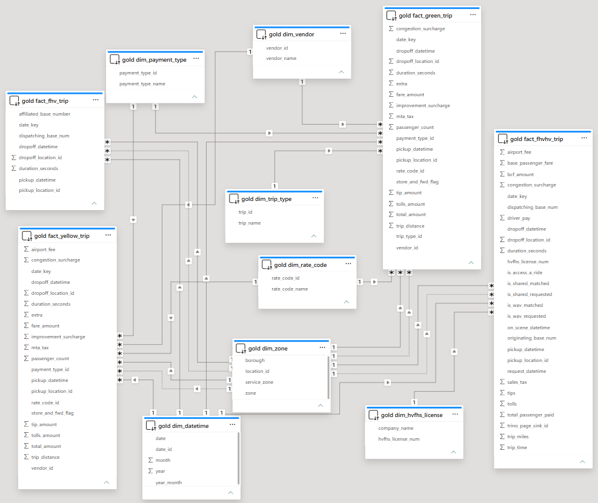

# NYC Taxi
>*A journey of working with heterogeneous data, where each source has its own structure and rhythm.*

## Table of Contents

- [Overview](#overview)
- [Architecture](#architecture)
- [Data Quality](#data-quality)
- [Superset Dashboard Demo](#superset-dashboard-demo)
- [Data Source](#data-source)
- [Project Structure](#project-structure)

## Overview
&nbsp;&nbsp;&nbsp;&nbsp;&nbsp;This platform delivers a pipeline that ingests, cleans, and transforms raw, heterogeneous NYC taxi data into optimized analytical layers. By enforcing a multi-tiered architecture, it progressively refines raw data into structured datasets and analytical data marts suitable for downstream analysis.

## Architecture

&nbsp;&nbsp;&nbsp;&nbsp;&nbsp;The analytics workflow processes NYC taxi datasets through separated cleaning, staging, and transformation stages. Validating and transforming the data step by step ensures that errors are caught early and that processing remains consistent as data size increases.


&nbsp;&nbsp;&nbsp;&nbsp;&nbsp;Building upon this foundation, the curated data is modeled into distinct trip facts and shared business dimensions. This dimensional organization forms a clear semantic layer that standardizes metrics across different fleets and simplifies analytical queries for downstream reporting.


## Data Quality

### 1.Completeness

#### `fhv`

| Column | Null Count | STATUS |
| ------ | ---------- | ------ |
| dispatching_base_num | 0 | PASS |
| pickup_datetime | 0 | PASS |
| dropOff_datetime | 0 | PASS |
| PUlocationID | 41830310 | PASS |
| DOlocationID | 8362711 | PASS |
| SR_Flag | 51054441 | PASS |
| Affiliated_base_number | 522470 | REVIEW |

#### `fhvhv`

| Column | Null Count | STATUS |
| ------ | ---------- | ------ |
| hvfhs_license_num | 0 | PASS |
| dispatching_base_num | 0 | PASS |
| originating_base_num | 157385436 | REVIEW |
| request_datetime | 0 | PASS |
| on_scene_datetime | 71022917 | REVIEW |
| pickup_datetime | 0 | PASS |
| dropoff_datetime | 0 | PASS |
| PULocationID | 0 | PASS |
| DOLocationID | 0 | PASS |
| trip_miles | 0 | PASS |
| trip_time | 0 | PASS |
| base_passenger_fare | 0 | PASS |
| tolls | 0 | PASS |
| bcf | 0 | PASS |
| sales_tax | 0 | PASS |
| congestion_surcharge | 0 | PASS |
| airport_fee | 0 | PASS |
| tips | 0 | PASS |
| driver_pay | 0 | PASS |
| shared_request_flag | 0 | PASS |
| shared_match_flag | 0 | PASS |
| access_a_ride_flag | 0 | PASS |
| wav_request_flag | 0 | PASS |
| wav_match_flag | 0 | PASS |

#### `green`

| Column | Null Count | STATUS |
| ------ | ---------- | ------ |
| VendorID | 0 | PASS |
| lpep_pickup_datetime | 0 | PASS |
| lpep_dropoff_datetime | 0 | PASS |
| store_and_fwd_flag | 103763 | REVIEW |
| RatecodeID | 103763 | RESOLVED |
| PULocationID | 0 | PASS |
| DOLocationID | 0 | PASS |
| passenger_count | 103763 | REVIEW |
| trip_distance | 0 | PASS |
| fare_amount | 0 | PASS |
| extra | 0 | PASS |
| mta_tax | 0 | PASS |
| tip_amount | 0 | PASS |
| tolls_amount | 0 | PASS |
| ehail_fee | 1462605 | REVIEW |
| improvement_surcharge | 0 | PASS |
| total_amount | 0 | PASS |
| payment_type | 103763 | RESOLVED |
| trip_type | 103894 | REVIEW |
| congestion_surcharge | 103763 | REVIEW |

#### `yellow`

| Column | Null Count | STATUS |
| ------ | ---------- | ------ |
| VendorID | 0 | PASS |
| tpep_pickup_datetime | 0 | PASS |
| tpep_dropoff_datetime | 0 | PASS |
| passenger_count | 20515406 | REVIEW |
| trip_distance | 0 | PASS |
| RatecodeID | 20515406 | RESOLVED |
| store_and_fwd_flag | 20515406 | REVIEW |
| PULocationID | 0 | PASS |
| DOLocationID | 0 | PASS |
| payment_type | 0 | PASS |
| fare_amount | 0 | PASS |
| extra | 0 | PASS |
| mta_tax | 0 | PASS |
| tip_amount | 0 | PASS |
| tolls_amount | 0 | PASS |
| improvement_surcharge | 0 | PASS |
| total_amount | 0 | PASS |
| congestion_surcharge | 20515406 | REVIEW |
| Airport_fee | 20515406 | REVIEW |

### 2.Timeliness

#### `fhv`

| Check | Condition | Result | Status |
| ----- | --------- | ------ | ------ |
| Out of bound pickup | `year(pickup_datetime) < 2024 OR year(pickup_datetime) > 2026` | 0 | PASS |
| Future Dates | `pickup_datetime > current_timestamp` | 0 | PASS |
| Negative Duration | `dropOff_datetime < pickup_datetime` | 293 | FAIL |
| Zero Duration | `pickup_datetime == dropOff_datetime` | 44 | REVIEW |
| Excessive Duration | `(dropOff_datetime - pickup_datetime) > 24 hours` | 15670 | REVIEW |

#### `fhvhv`

| Check | Condition | Result | Status |
| ----- | --------- | ------ | ------ |
| Out of bound pickup | `year(pickup_datetime) < 2024 OR year(pickup_datetime) > 2026` | 0 | PASS |
| Future Dates | `pickup_datetime > current_timestamp()` | 0 | PASS |
| Negative Duration | `dropoff_datetime < pickup_datetime` | 21857 | FAIL |
| Zero Duration | `dropoff_datetime == pickup_datetime` | 56 | REVIEW |
| Zero Duration with Distance | `dropoff_datetime == pickup_datetime and trip_miles > 0` | 4 | REVIEW |
| Excessive Duration | `(dropoff_datetime - pickup_datetime) > 24 hours` | 0 | PASS |
| Driver On Scene Lag | `on_scene_datetime < request_datetime` | 7379988 | REVIEW |
| Request to Pickup Order | `pickup_datetime < request_datetime` | 6494458 | REVIEW |

#### `green`

| Check | Condition | Result | Status |
| ----- | --------- | ------ | ------ |
| Out of bound pickup | `year(lpep_pickup_datetime) < 2024 OR year(lpep_pickup_datetime) > 2026` | 13 | FAIL |
| Future Dates | `lpep_pickup_datetime > current_timestamp()` | 0 | PASS |
| Negative Duration | `lpep_dropoff_datetime < lpep_pickup_datetime` | 1348 | FAIL |
| Zero Duration | `lpep_dropoff_datetime == lpep_pickup_datetime` | 1378 | REVIEW |
| Zero Duration with Distance | `lpep_dropoff_datetime == lpep_pickup_datetime and trip_distance > 0` | 206 | REVIEW |
| Excessive Duration | `(lpep_dropoff_datetime - lpep_pickup_datetime) > 24 hours` | 3 | REVIEW |

#### `yellow`

| Check | Condition | Result | Status |
| ----- | --------- | ------ | ------ |
| Out of bound pickup | `year(tpep_pickup_datetime) < 2024 OR year(tpep_pickup_datetime) > 2026` | 65 | FAIL |
| Future Dates | `tpep_pickup_datetime > current_timestamp()` | 0 | PASS |
| Negative Duration | `tpep_dropoff_datetime < tpep_pickup_datetime` | 3815 | FAIL |
| Zero Duration | `tpep_dropoff_datetime == tpep_pickup_datetime` | 792374 | REVIEW |
| Zero Duration with Distance | `tpep_dropoff_datetime == tpep_pickup_datetime and trip_distance > 0` | 760101 | REVIEW |
| Excessive Duration | `(tpep_dropoff_datetime - tpep_pickup_datetime) > 24 hours` | 735 | REVIEW |

### 3.Validity

#### `fhv`

| Column | Condition | Result | Status |
| ------ | --------- | ------ | ------ |
| PULocationID | `PULocationID not between 1 and 265` | 0 | PASS |
| DOLocationID | `DOLocationID not between 1 and 265` | 0 | PASS |

#### `fhvhv`

| Column | Condition | Result | Status |
| ------ | --------- | ------ | ------ |
| hvfhs_license_num | `hvfhs_license_num not in (HV0003, HV0005)` | 0 | PASS |
| shared_request_flag | `shared_request_flag not in ('Y', 'N')` | 0 | PASS |
| shared_match_flag | `shared_match_flag not in ('Y', 'N')` | 0 | PASS |
| access_a_ride_flag | `access_a_ride_flag not in ('Y', 'N')` | 0 | PASS |
| wav_request_flag | `wav_request_flag not in ('Y', 'N')` | 0 | PASS |
| wav_match_flag | `wav_match_flag not in ('Y', 'N')` | 0 | PASS |
| trip_miles | `trip_miles < 0` | 0 | PASS |
| PULocationID | `PULocationID not between 1 and 265` | 0 | PASS |
| DOLocationID | `DOLocationID not between 1 and 265` | 0 | PASS |

#### `green`

| Column | Condition | Result | Status |
| ------ | --------- | ------ | ------ |
| VendorID | `VendorID not in (1, 2, 6)` | 0 | PASS |
| passenger_count | `passenger_count <= 0 or passenger_count > 9` | 17904 | REVIEW |
| trip_distance | `trip_distance < 0` | 0 | PASS |
| fare_amount | `fare_amount < 0` | 4489 | REVIEW |
| total_amount | `total_amount < fare_amount` | 5293 | REVIEW |
| payment_type | `payment_type not in (0, 1, 2, 3, 4, 5)`| 0 | PASS |
| PULocationID | `PULocationID not between 1 and 265` | 0 | PASS |
| DOLocationID | `DOLocationID not between 1 and 265` | 0 | PASS |
| RatecodeID | `RatecodeID not in (1, 2, 3, 4, 5, 6, 99)` | 0 | PASS |
| extra | `extra < 0` | 1817 | REVIEW |
| mta_tax | `mta_tax < 0` | 3956 | REVIEW |
| tolls_amount | `tolls_amount < 0` | 8 | REVIEW |
| trip_type | `trip_type not in (1, 2)` | 0 | PASS |

#### `yellow`

| Column | Condition | Result | Status |
| ------ | --------- | ------ | ------ |
| VendorID | `VendorID not in (1, 2, 6, 7)` | 0 | PASS |
| passenger_count | `passenger_count <= 0 OR passenger_count > 9` | 726279 | REVIEW |
| trip_distance | `trip_distance < 0` | 0 | PASS |
| fare_amount | `fare_amount < 0` | 3695111 | REVIEW |
| total_amount | `total_amount < fare_amount` | 1547150 | REVIEW |
| payment_type | `payment_type not in (0, 1, 2, 3, 4, 5)`| 0 | PASS |
| PULocationID | `PULocationID not between 1 and 265` | 0 | PASS |
| DOLocationID | `DOLocationID not between 1 and 265` | 0 | PASS |
| RatecodeID | `RatecodeID not in (1, 2, 3, 4, 5, 6, 99)` | 0 | PASS |
| extra | `extra < 0` | 778824 | REVIEW |
| mta_tax | `mta_tax < 0` | 1457460 | REVIEW |
| tolls_amount | `tolls_amount < 0` | 131534 | REVIEW |

### 4.Integrity

| Check | Result | Status |
| ----- | ------ | ------ |
| PULocationID Foreign Key Integrity Check | 0 | PASS |
| DOLocationID Foreign Key Integrity Check | 0 | PASS |

### 5.Uniqueness

| Table | Column | Result | Status |
| ----- | ------ | ------ | ------ |
| yellow | All Columns | 0 | PASS |
| green | `VendorID, lpep_pickup_datetime, lpep_dropoff_datetime, PULocationID, DOlocationID, total_amount` | 0 | PASS |
| fhvhv | All Columns | 0 | PASS |
| fhv | `dispatching_base_num, pickup_datetime, dropOff_datetime, PUlocationID, DOlocationID, Affiliated_base_number` | 51101 | FAIL |

### 6.Consistency

#### fhv

| Check | Condition | Result | Status |
| ----- | --------- | ------ | ------ |
| Same Zone Long Trip | `PUlocationID == DOlocationID AND (unix_timestamp(dropOff_datetime) - unix_timestamp(pickup_datetime)) > 3600` | 17533 | REVIEW |
| Outside Zone Pair | `PUlocationID in (264, 265) and DOlocationID in (264, 265)` | 20717 | REVIEW |

#### fhvhv

| Check | Condition | Result | Status |
| ----- | --------- | ------ | ------ |
| Same Zone Long Trip | `PUlocationID == DOlocationID AND (unix_timestamp(dropoff_datetime) - unix_timestamp(pickup_datetime)) > 3600` | 118081 | REVIEW |
| Driver Pay Anomaly | `driver_pay > (base_passenger_fare + tolls + bcf + sales_tax +  congestion_surcharge + airport_fee + tips) * 2` | 938110 | REVIEW |
| Shared Match Conflict | `shared_request_flag == 'N' AND shared_match_flag == 'Y'`| 22576 | FAIL |
| Shared Trip Zero Distance | `shared_match_flag == 'Y' AND trip_miles == 0` | 806 | REVIEW |
| Outside Zone Pair | `PUlocationID in (264, 265) and DOlocationID in (264, 265)` | 8817 | REVIEW |

#### yellow

| Check | Condition | Result | Status |
| ----- | --------- | ------ | ------ |
| Same Zone Long Trip | `PUlocationID == DOlocationID AND (unix_timestamp(tpep_dropoff_datetime) - unix_timestamp(tpep_pickup_datetime)) > 3600` | 14485 | REVIEW |
| Total Amount Mismatch | `abs(total_amount - (fare_amount + extra + mta_tax + tip_amount + tolls_amount + improvement_surcharge + congestion_surcharge)) > 0.01` | 52042735 | REVIEW |
| Non-Credit Card Tip | `payment_type != 1 AND tip_amount > 0` | 1912675 | REVIEW |
| Distance without Fare | `trip_distance > 1.0 AND fare_amount <= 0` | 2724720 | REVIEW |
| Negotiated Fare Invalid | `RatecodeID == 5 AND fare_amount <= 0` | 44611 | REVIEW |
| Outside Zone Pair | `PUlocationID in (264, 265) and DOlocationID in (264, 265)` | 161008 | REVIEW |

#### green

| Check | Condition | Result | Status |
| ----- | --------- | ------ | ------ |
| Same Zone Long Trip | `PUlocationID == DOlocationID AND (unix_timestamp(lpep_dropoff_datetime) - unix_timestamp(lpep_pickup_datetime)) > 3600` | 2306 | REVIEW |
| Total Amount Mismatch | `abs(total_amount - (fare_amount + extra + mta_tax + tip_amount + tolls_amount + improvement_surcharge + congestion_surcharge)) > 0.01` | 215009 | REVIEW |
| Non-Credit Card Tip | `payment_type != 1 AND tip_amount > 0` | 152 | REVIEW |
| Distance without Fare | `trip_distance > 1.0 AND fare_amount <= 0` | 5390 | REVIEW |
| Negotiated Fare Invalid | `RatecodeID == 5 AND fare_amount <= 0` | 1212 | REVIEW |
| Outside Zone Pair | `PUlocationID in (264, 265) and DOlocationID in (264, 265)` | 3523 | REVIEW |

## Superset Dashboard Demo

A Superset dashboard is included to visualize NYC Taxi data.


## Data Source

&nbsp;&nbsp;&nbsp;&nbsp;&nbsp;The architecture is built on the official [NYC TLC Trip](https://www.nyc.gov/site/tlc/about/tlc-trip-record-data.page) data, which provides detailed trip-level records including pickup/dropoff times, locations, fares, and trip characteristics. Additionally, these trip records are mapped directly to geographic areas for analytical purposes using the [Taxi Zone Lookup](https://d37ci6vzurychx.cloudfront.net/misc/taxi_zone_lookup.csv) data, which translates location IDs into specific boroughs and zones.

## Project Structure

```
nyc-taxi-lakehouse
├───config
│   ├───schema
│   └───silver
├───dags
│   ├───configs
│   │   ├───bronze
│   │   ├───gold
│   │   ├───schema
│   │   └───silver
│   └───root
├───docker
├───image
├───nyc_analytics
│   └───models
│       ├───dim
│       ├───fact
│       ├───mart
│       └───staging
├───plugins
└───src
    ├───catalog
    ├───client
    ├───ingestion
    ├───Service
    ├───transform
    └───utils
```