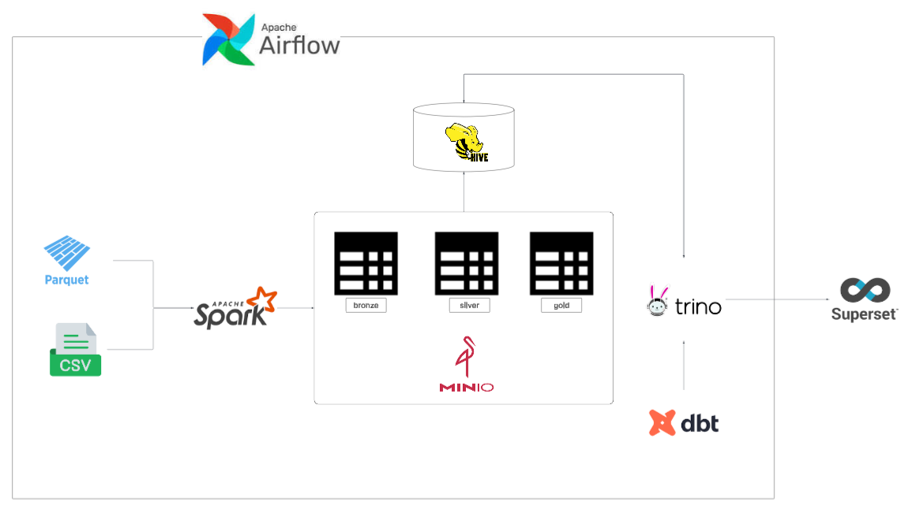
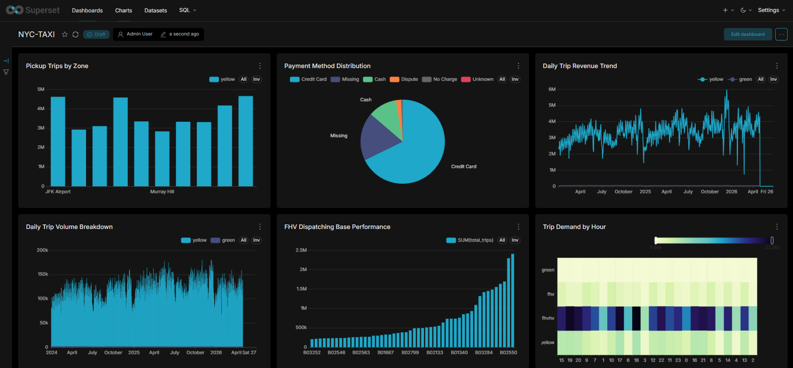

# NYC Taxi
>*A journey of working with heterogeneous data, where each source has its own structure and rhythm.*

## Overview
This platform delivers a pipeline that ingests, cleans, and transforms raw, heterogeneous NYC taxi data into optimized analytical layers. By enforcing a multi-tiered architecture, it progressively refines raw data into structured datasets and analytical data marts suitable for downstream analysis.

## Architecture

## Superset Dashboard Demo

A Superset dashboard is included to visualize NYC Taxi data.

## Data Source

The architecture is built on the official [NYC TLC Trip](https://www.nyc.gov/site/tlc/about/tlc-trip-record-data.page) data, which provides detailed trip-level records including pickup/dropoff times, locations, fares, and trip characteristics. Additionally, these trip records are mapped directly to geographic areas for analytical purposes using the [Taxi Zone Lookup](https://d37ci6vzurychx.cloudfront.net/misc/taxi_zone_lookup.csv) data, which translates location IDs into specific boroughs and zones.